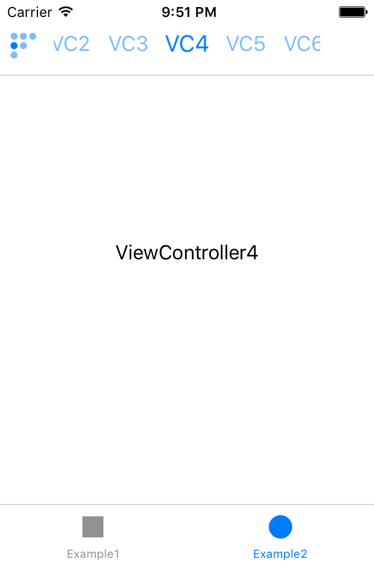

# PageBasedKit

PageBasedKit 是用于多个平级ViewController可以左右来回切换的组件。

它包含以下独立类：

* PBRootViewController － 管理子视图控制器与UIPageViewController对象
* PBNavigationBar － 顶部导航栏
* PBIndicatorView － 页面指示器

# 演示

查看并运行`Example/PageBasedKitExample/PageBasedKitExample.xcodeproj`

# 安装

### CocoaPods

1. 在`Podfile`中添加`pod "PageBasedKit"`
2. 执行命令`pod install`或`pod update`
3. 导入要使用的类

### 手动

1. 下载或克隆库的所有内容到本地
2. 将`Class`文件夹下的所有源文件添加到你的工程中
3. 导入要使用的类

# 使用

详见`Example/PageBasedKitExample/PageBasedKitExample.xcodeproj`

# 要求

* 支持iOS 8.0 以上系统
* 使用ARC
* 请在Xcode 9.0 以上版本打开示例项目

# 许可

详情见 LICENSE 文件。

